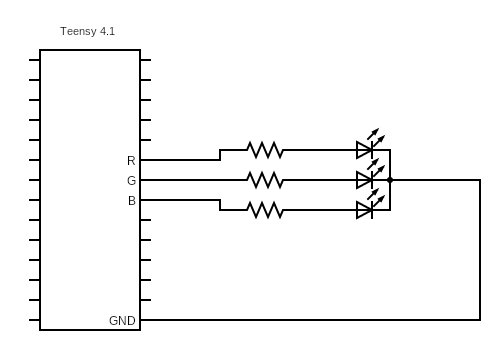

# Robocup Rustware

## Description

In 2023, we decided to switch microcontrollers from the team built A-Train microcontroller to the off-the-shelf Teensy 4.1 microcontroller.  In making this switch the team also decided that a full firmware rewrite was in order.

Therefore, this repository contains the code for the firmware for the RoboJackets RoboCup team.

## Setup

If you are running linux or macos, run:
```sh
./setup/unix.sh
```

If running windows, follow the steps in [setup/WindowsSetup.md](setup/WindowsSetup.md). 

To ensure the correct version of Teensy loader is used by your system ensure the line under your operating system (i.e. "MacOS", "Windows", and "Linux") is uncommented in [control/tools/runner.rs](control/tools/runner.rs)

## Common Commands

### Running main.rs

Kelvin created a runner to make running code on the teensy easier.  To utilize this runner run:

```sh
cargo run --target thumbv7em-none-eabihf
```

### examples (and tests)

To allow specific modules of our codebase to be tested in separate, we will attempt to create examples that isolate a specific device driver.  To run any of these sanity checks run:

```sh
cargo run --example <example_name> --target thumbv7em-none-eabihf
```

### Documentation

To open the documentation for internal drivers, libraries, and dependencies run:

```sh
cargo docs --open
```

## New Members Project

As you may see, the repository is currently quite bare.  This is due to the rewrite having only started this semester (and a good amount of work and poc testing being done in other repositories).  Therefore, the documentation for a new member project is relatively sparse and probably seems thrown together at the last moment (that's because it is). As much as possible, this tutorial will treat you as though this is your first time seeing Rust and working with a microcontroller; as such, the tutorial will try to relate as many concepts as possible to more common coding langauges like Java. 

Regardless, the new member project is to create an RGB Led Device Driver. 

### Description

An RGB Led Device Driver is a self-contained driver utilizing the rust embedded_hal features (more information [here]()).  By using the embedded_hal features and traits, it is possible to create a driver that works regardless of the underlying architecture of the microcontroller used (i.e. you could use this driver for arduino, raspberry pi, etc.).  The main point of this driver is to provide an interface to turn the led a specific color via a singular command (plus this is largely what most of this semester's firmware development will focus on).

### Steps

1. Install Rust by Following the Instructions [here](https://www.rust-lang.org/tools/install)

2. Clone the repo

```sh
git clone https://github.com/RoboJackets/robocup-rustware.git
```

3. Branch off the repo

```sh
git checkout -b <first_name>_<last_name>-firmware_tutorial
```

4. Setup the Teensy Loader CLI

- Linux:

```sh
./setup/unix.sh
```

- Mac:

```sh
OS=MACOSX ./setup/unix.sh
```

- Windows: Check [Windows Setup](setup/WindowsSetup.md) in setup folder

5. Cd into the drivers folder and create a new lib crate

```sh
cd drivers
cargo new --lib <rgb_led_driver_name> 
```

6. Add the new lib crate to the [manifest file (Cargo.toml)](Cargo.toml) under workspaces (Technically Optional)
7. Write an RGB Led Driver [see](#writing-an-rgb-led-driver)
8. Write a test (example) in the examples folder to demo an RTIC application using the RGB Led Driver [see](#creating-a-test-example)
9. Create a PR with the RGB Led Driver
10. Demo the Driver with either Nate or Kelvin

### Codebase Structure & Rust Tips

#### Codebase Structure

This section aims to explain the very high level function of two different sections of our codebase and their associated structure. 

There is a folder called "drivers" that contains the "source material" for the drivers to function as intended. To ensure thorough understanding, a driver is a piece of software that helps to facilitate communication between a piece of hardware and the existing software. Drivers are essentially the foundation of our interactions with our robots. Within the drivers folder you will find a file called "lib.rs" in the "src" subfolder. This file is the closest thing to Java's interface/abstract class in that it specifies the structre of the class and any methods that will be used when the object is eventually implemented. 

Now, open up the folder called "examples" which outlines all the available example files (the "demo.rs" file is the standard layout that is used to sanity check creating new files and we recommend you use this file to get started on your file you will make in the "examples" folder). The file you will create in this folder (like all other files in this folder) will be the one whose code is actually run and executed. 

#### Rust Tips 

As there are many useful online resource to learn Rust, this tutorial will not outline how to learn Rust, but it will include useful tips that previous members have found helpful when starting to work with Rust. These tips will likely not help too much until you have looked at the codebase and started working a little bit with the code, so please reference the following once you have taken a dive into the codebase:

1. The "mod" denotes a module in Rust, which can be thought of as the equivalent of a file, so your relevant imports must be in the given module to be used.
2. Each init() function will have a struct labeled local and shared. You can think of these like predefining all potential parameters that you will eventually use in your functions. Instead of directly accessing this information as you would with a parameter, you must access it using the context for the method (see other files in the example folder such as manual.rs. Another important detail: if you are creating an object in the local or shared structs, then you are essentially creating "an abstract class" (not really a class) in the sense that the created variable in these structs will later be implemented by your code and the implemented code **must** match the layout that is specified in the struct.  


### Writing an RGB Led Driver

#### Description

As an intro project you are given the following circuit diagram:


Your goal is to create a driver that (regardless of the underlying microcontroller) can change the color of this Led to match the capabilities below.  To complete this you should write the driver using embedded hal traits (nothing from the Teensy 4 library should be used). This project will involve writing the related code for the driver that will be uploaded to the microcontroller (a small computer that controls a specific operation in a given system). Once the code is written, you must connect your microcontroller to your laptop, load the .hex file onto the microcontroller, and then connect the microcontroller to a breadboard. You will need connections from your microcontroller to the breadboard for ground, red, green, and blue outputs with associated resistors that will send output to generate a final output of the desired colors. 

#### Helpful Tips

Some quick tips that have proven to be useful to previous members who completed the tutorial:

1. Most of the time, the VSCode quick fixes do not address the issue (for example, VSCode will often suggest adding the "dyn" keyword to fix with size allocation, but the final solution ideally will not use this keyword).
2. An **EXTREMELY** useful tool when developing (think of this like looking at Oracle's Java documentation but for your rust project) is to get out the docs generated by cargo. The command to generate these docs and open them up is:
```sh
cargo doc --open
```
3. When working with the outputs and output pins, keep this in mind: Output is essentially the concrete implementation of the abstract OutputPin; as such, we need to use OutputPin to specify that the type is of something is going to be an OutputPin, but Output is used when we want to specify a pin in an implementation setting  


#### Working in Our Codebase

One of the first things you are probably wondering is how to run a file and see its output; if so, then good news! Running a file will depend on your OS and how our current repository is set up, but here is a solution that will generate a temporary file that will be continually written over in your repository that you can load into your microcontroller with the file select option (feel free to put this command into an LLM to understand it more if you are curious):

```sh
cargo objcopy --release --example ping_pong --target thumbv7em-none-eabihf -- -O ihex text.hex
```

One other vital piece of information that should help you get started is understanding what files need to be created/edited in order to get started: 
1. Create a folder in the drivers folder to house the new driver called "rgb_led_driver_name", create a "src" folder (if one hasn't already been created), and then create a lib.rs file
2. Create a file in the "examples" folder that will serve as the file to implement the code you create in your drivers folder
3. Add the relevant dependencies for the rgb driver in the Cargo.toml files - edit the one in the root folder and the one in the rgb_led_driver_name folder 

#### Capabilities

The RGB Led Driver needs to have the following basic capabilities:

- Create a new driver from pins
- turn off an led
- turn a led red
- turn a led green
- turn a led blue
- turn a led yellow
- turn a led purple
- turn a led (cyan or turquoise)

feel free to experiment and add additional functionalities to the driver.  The above functionalities are only the most basic necessary features.

### Creating a Test (example)

In Rust, testing is paramount and even though this is no_std firmware, it is still useful for us to make sure that all of our drivers work in isolation.  Therefore, we'd like to have an example file (located in the examples/ directory) that contains an RTIC check that the functionalities of a driver are implemented correctly.

Ideally, every function / method in the driver should be used in the example with an optimal test making use of one driver method per software task (this isn't always possible and for the led driver it is fully allowable to have a task make the led red and then turn it off).

For more information regarding RTIC I would highly recommend [the RTIC book](https://rtic.rs/2/book/en/).  It is relatively easy to read and should provide you with ample information that will make completing this task much easier.

TLDR:

Using [main.rs](src/main.rs) as an example, write a series of software tasks utilizing the various methods of the driver you wrote in the step before.

## Device Driver Documentation

Over time as drivers are written they will have sections in a separate markdown file devoted to how they work.  The device driver documentation can be found [here](drivers/drivers.md)

## Examples Documentation

Over time as examples and tests are written they will have sections in a separate markdown file devoted to how they work.  The examples / sanity checks documentation can be found [here](examples/examples.md)

## Example Device Drivers

To give a little bit of background as to what a good device driver should kind of look like I'm going to link a few examples below:

- [OLED Display Driver](https://github.com/jamwaffles/ssd1306/tree/master) <- a bit complex but arguably Rust's most used driver
- [W25q32jv Flash Driver](https://github.com/tweedegolf/w25q32jv/tree/main) <- Ok spi flash driver
- [Radio Driver](https://github.com/astro/embedded-nrf24l01) <- Semi-working well written radio driver

## Useful Links

### Embedded Programming

- [RTIC Book](https://rtic.rs/2/book/en/) <- super useful guide for RTIC
- [Embedded Rust Book](https://docs.rust-embedded.org/book/) <- Useful guide to embedded development in rust

### Learning Rust
- [Rust Book](https://doc.rust-lang.org/book/) <- well written book teaching the language
- [Rustlings](https://github.com/rust-lang/rustlings/) <- set of small examples for reading and writing Rust code
- [Rust By Example](https://doc.rust-lang.org/rust-by-example/) <- Book of example programs in Rust to illustrate various Rust concepts
